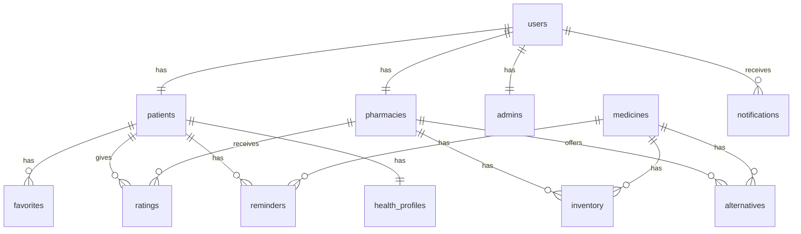

# Daway Database Schema

## users

| Column      | Type                           | Description                    |
| ----------- | ------------------------------ | ------------------------------ |
| id          | bigint, AI, PK                 | معرف المستخدم                  |
| name        | string                         | الاسم الكامل                   |
| phone       | string, unique                 | رقم الهاتف                     |
| email       | string, nullable               | البريد الإلكتروني              |
| password    | string, nullable               | كلمة المرور (للصيدلية والأدمن) |
| role        | enum: patient, pharmacy, admin | دور المستخدم                   |
| is_active   | boolean, default: true         | حالة الحساب                    |
| pharmacy_id | string, unique, nullable       | معرف الصيدلية (للصيدليات فقط)  |
| created_at  | timestamp                      | تاريخ الإنشاء                  |
| updated_at  | timestamp                      | تاريخ التحديث                  |

## patients

| Column            | Type                     | Description       |
| ----------------- | ------------------------ | ----------------- |
| id                | bigint, PK, FK: users.id | معرف المريض       |
| profile_image     | string, nullable         | صورة الملف الشخصي |
| latitude          | decimal, nullable        | خط العرض          |
| longitude         | decimal, nullable        | خط الطول          |
| allergies         | json, nullable           | الحساسية          |
| chronic_diseases  | json, nullable           | الأمراض المزمنة   |
| blood_type        | string, nullable         | فصيلة الدم        |
| emergency_contact | string, nullable         | رقم الطوارئ       |

## pharmacies

| Column        | Type                     | Description          |
| ------------- | ------------------------ | -------------------- |
| id            | bigint, PK, FK: users.id | معرف الصيدلية        |
| name          | string                   | اسم الصيدلية         |
| logo          | string, nullable         | شعار الصيدلية        |
| phone         | string                   | رقم الهاتف           |
| email         | string, nullable         | البريد الإلكتروني    |
| latitude      | decimal                  | خط العرض             |
| longitude     | decimal                  | خط الطول             |
| address       | text                     | العنوان              |
| working_hours | json                     | ساعات العمل (كل يوم) |
| avg_rating    | decimal, default: 0      | متوسط التقييم        |

## admins

| Column      | Type                     | Description    |
| ----------- | ------------------------ | -------------- |
| id          | bigint, PK, FK: users.id | معرف الأدمن    |
| permissions | json                     | صلاحيات الأدمن |

## medicines

| Column            | Type                    | Description          |
| ----------------- | ----------------------- | -------------------- |
| id                | bigint, AI, PK          | معرف الدواء          |
| name              | string                  | اسم الدواء التجاري   |
| active_ingredient | string                  | المادة الفعالة       |
| description       | text, nullable          | وصف الدواء           |
| category          | string, nullable        | التصنيف              |
| image             | string, nullable        | صورة الدواء          |
| created_by_admin  | boolean, default: false | تمت إضافته من الأدمن |

## inventory

| Column       | Type                      | Description     |
| ------------ | ------------------------- | --------------- |
| id           | bigint, AI, PK            | معرف المخزون    |
| pharmacy_id  | bigint, FK: pharmacies.id | معرف الصيدلية   |
| medicine_id  | bigint, FK: medicines.id  | معرف الدواء     |
| quantity     | integer, default: 0       | الكمية المتوفرة |
| price        | decimal                   | السعر           |
| is_available | boolean, default: false   | حالة التوفر     |
| updated_at   | timestamp                 | تاريخ التحديث   |

## alternatives

| Column                  | Type                      | Description   |
| ----------------------- | ------------------------- | ------------- |
| id                      | bigint, AI, PK            | معرف البديل   |
| medicine_id             | bigint, FK: medicines.id  | الدواء الأصلي |
| alternative_medicine_id | bigint, FK: medicines.id  | الدواء البديل |
| pharmacy_id             | bigint, FK: pharmacies.id | معرف الصيدلية |

## favorites

| Column            | Type                    | Description                    |
| ----------------- | ----------------------- | ------------------------------ |
| id                | bigint, AI, PK          | معرف المفضلة                   |
| patient_id        | bigint, FK: patients.id | معرف المريض                    |
| favoriteable_type | string                  | نوع العنصر (pharmacy/medicine) |
| favoriteable_id   | bigint                  | معرف العنصر                    |

## ratings

| Column      | Type                      | Description    |
| ----------- | ------------------------- | -------------- |
| id          | bigint, AI, PK            | معرف التقييم   |
| patient_id  | bigint, FK: patients.id   | معرف المريض    |
| pharmacy_id | bigint, FK: pharmacies.id | معرف الصيدلية  |
| rating      | integer, 1-5              | التقييم (نجوم) |
| comment     | text, nullable            | التعليق        |
| created_at  | timestamp                 | تاريخ التقييم  |

## reminders

| Column      | Type                         | Description   |
| ----------- | ---------------------------- | ------------- |
| id          | bigint, AI, PK               | معرف التذكير  |
| patient_id  | bigint, FK: patients.id      | معرف المريض   |
| medicine_id | bigint, FK: medicines.id     | معرف الدواء   |
| time        | time                         | وقت الجرعة    |
| repeat_type | enum: daily, weekly, monthly | نوع التكرار   |
| is_active   | boolean, default: true       | حالة التذكير  |
| created_at  | timestamp                    | تاريخ الإنشاء |

## health_profiles

| Column            | Type                    | Description      |
| ----------------- | ----------------------- | ---------------- |
| id                | bigint, AI, PK          | معرف الملف الصحي |
| patient_id        | bigint, FK: patients.id | معرف المريض      |
| allergies         | json                    | الحساسية         |
| chronic_diseases  | json                    | الأمراض المزمنة  |
| blood_type        | string                  | فصيلة الدم       |
| emergency_contact | string                  | رقم الطوارئ      |
| last_synced_at    | timestamp               | تاريخ آخر مزامنة |

## first_aid

| Column       | Type             | Description     |
| ------------ | ---------------- | --------------- |
| id           | bigint, AI, PK   | معرف الإسعاف    |
| title        | string           | عنوان الحالة    |
| steps        | json             | خطوات الإسعاف   |
| image        | string, nullable | صورة توضيحية    |
| last_updated | timestamp        | تاريخ آخر تحديث |

## notifications

| Column     | Type                    | Description                                |
| ---------- | ----------------------- | ------------------------------------------ |
| id         | bigint, AI, PK          | معرف الإشعار                               |
| user_id    | bigint, FK: users.id    | معرف المستخدم                              |
| type       | string                  | نوع الإشعار (reminder/availability/refill) |
| title      | string                  | عنوان الإشعار                              |
| body       | text                    | محتوى الإشعار                              |
| data       | json, nullable          | بيانات إضافية                              |
| is_read    | boolean, default: false | حالة القراءة                               |
| created_at | timestamp               | تاريخ الإشعار                              |

## otp_codes

| Column     | Type                    | Description    |
| ---------- | ----------------------- | -------------- |
| id         | bigint, AI, PK          | معرف OTP       |
| phone      | string                  | رقم الهاتف     |
| code       | string                  | رمز التحقق     |
| expires_at | timestamp               | تاريخ الانتهاء |
| is_used    | boolean, default: false | تم استخدامه    |

## Relationships

